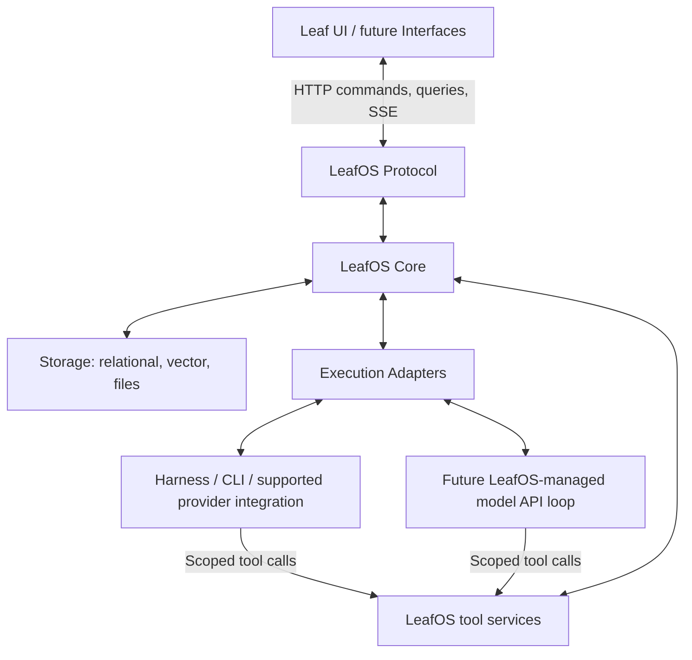

# LeafOS 3.0 — Initial architecture and implementation plan

Status: first working plan, approved direction from discussion; implementation has not started.

Date: 2026-09-16

This document records the agreed architectural direction and proposed implementation sequence. Endpoint names, tool names, and record shapes below are illustrative until the protocol and data-model design is completed. Identity, organization membership, global agent memory, and group ownership follow [Decision block 1](./01-identity-and-ownership.md). Chats, threads, message preparation, delegation, and durable interactions follow [Decision block 2](./02-conversations-and-work-lifecycle.md), dated 2026-09-17. Execution context, installable adapter packages, agent tools, publication, and continuation follow [Decision block 3](./03-execution-adapters-and-agent-capabilities.md). The selected PostgreSQL/pgvector engine, logical data spaces, agent homes, embedding-service direction, deletion, and future portability follow [Decision block 4](./04-storage-and-recovery.md). These decision records take precedence over earlier tentative suggestions. Detailed schemas, memory algorithms, and the UI framework remain open.

## 1. Product direction

Protocol decisions are now recorded in [Decision block 5 — LeafOS Protocol](./05-leafos-protocol.md). It takes precedence over earlier tentative protocol details here and contains the operation-family map, accepted simplifications, end-to-end acceptance scenarios, and remaining schema/platform work. Read it with blocks 1–4 before implementation.

LeafOS is a persistent system that coordinates conversations and AI work. Interfaces connect to it through a stable protocol. Execution adapters connect it to harnesses and, eventually, LeafOS-managed model API loops.

Initially, one backend runs on one trusted host, with storage and execution on that host. The owner connects through Leaf UI from multiple devices over Tailscale. The architecture must admit multiple people later, without pretending that the first version already provides separate-user security or host isolation.

LeafOS 2.0 runs on the Mac Studio. During development, keep its laptop daemon stopped. Any future operational work must first follow current deployment and connection documentation and announce the connection or change. Writing this plan requires no connection, service start, deployment, or migration of 2.0.

### Initial scope

- Leaf UI as the only implemented interface.
- Text, links, images, documents, video attachments, and explicitly distinguished voice notes versus ordinary audio attachments.
- Automatic voice-note transcription using configured Spokenly CLI; expose the same service as an agent tool and hand failed transcription to the agent with the original audio and an explicit failure marker.
- Threads started by root messages, with replies queued inside a thread.
- Concurrent work across threads, including the same agent, with a configurable installation-wide ceiling of 20 active AI executions initially; delegated work counts toward this limit.
- Durable agent-to-agent requests, results, and continuation, displayed initially through concise activity-timeline entries.
- Live answer streaming, model-authored progress, multiple intermediate messages, and final messages.
- Approvals and questions that survive client disconnection and backend restarts.
- Codex as the first execution integration, following the existing 2.0 approach.
- Organization defaults and agent overrides for execution configuration.
- Managed uploads and generated attachments, accessible through the backend URL.
- Tailscale-only access with a single configured owner and a future authentication boundary.

### Deferred

- Slack and other interface implementations, including cross-interface conversation continuation.
- Live two-way voice.
- Additional harness adapters and a LeafOS-managed model API loop.
- Seamless transfer of live execution between providers.
- Multi-user login, human invitation flows, and full authorization policy. Organization memberships and visual-group management are in scope; see decision block 5.
- Remote execution workers and isolation between mutually untrusted users.
- Detailed physical organization/agent schemas, long-term memory algorithms, advanced scheduling, and future group-chat or detailed collaboration UI. Basic asynchronous delegation is in scope; identity and ownership follow decision block 1.
- Per-message execution-setting overrides, while reserving a place for them in configuration resolution.

## 2. Architectural boundaries and names

| Boundary | Responsibility |
| --- | --- |
| Interfaces | Present conversations and controls; submit commands; render events and files. |
| LeafOS Protocol | Define versioned commands, queries, events, attachments, errors, and capability discovery. |
| LeafOS Core | Own conversation state, queues, runs, interactions, event recovery, configuration resolution, and tool services. |
| Execution Adapters | Translate LeafOS requests, events, and tools to/from a particular execution integration. |
| Storage | Persist runtime records, ordered events, agent data, vector records, configuration, and file bytes. |



These are logical modules in one backend initially. They do not require separate deployments, services, message brokers, or public APIs between every component.

The LeafOS Protocol is a contract, not a separate process. Execution adapters are our connectors; an AI runtime is the system to which an adapter connects.

LeafOS owns its conversation IDs and history. External interface and provider session IDs are mappings, not primary identities. Provider-specific payloads stay at the adapter boundary.

## 3. Core concepts to formalize next

| Concept | Meaning |
| --- | --- |
| Installation | One LeafOS system; contains organizations and a root admin agent. |
| Organization | Shared instructions, execution defaults, storage, memberships, and visual groups. |
| Person | Stable human identity independent of organization; initially one configured owner. |
| Agent | Global identity, continuous memory, instructions, execution overrides, and files; may join multiple organizations. |
| Membership | Connects an existing human or agent to an organization without copying their identity or memory. |
| Group | Organization-wide visual collection of agent memberships; multiple groups may reference the same agent. |
| Chat | Participant-based conversation space in an organization or installation context; direct chats initially, group and dedicated agent chats later. |
| Thread | Independent conversation started by a root message within a chat; ordinary follow-ups queue while its primary workflow is active. |
| Delegation | Correlated agent-to-agent request, execution, result, and continuation relationship. |
| Message | Authored content with ordered parts, such as text and file references. |
| Command | Request to submit, stop, steer, retry, approve, deny, or answer. |
| Run | Durable logical unit of work, independent of a UI connection. |
| Attempt | One execution attempt for a run, with its provider/session identifiers. |
| Event | Ordered, persisted description of an observable change. |
| Interaction | Durable approval request or question awaiting a human response. |
| Artifact | Registered file metadata and managed bytes. |
| Provider session | Adapter-specific context associated with a thread and execution configuration. |

Records must preserve organization/owner scope from the beginning. Core services receive a trusted actor context; they must not infer the caller from an arbitrary user ID in a message payload. The first trusted-owner access resolver can later be replaced by authentication without changing every handler.

Membership and ownership semantics are defined in decision block 1. Full table definitions, conversation participant relationships, content schemas, and retention settings remain subsequent design work. Record ownership and memory provenance separately from access restrictions; the initial model does not forbid agents from accessing other agents' personal stores, although messaging is the encouraged collaboration route.

## 4. Communication and output semantics

### Interface to Core

Use ordinary HTTP commands and queries plus an SSE event stream. A configured base URL determines API, event, and file routes. Expose protocol version and capabilities, with a versioned namespace such as `/v1`.

Examples of distinct commands are message submission, cancellation, steering, and interaction resolution. A message is content carried by a command; it is not the representation of every possible action.

Persist accepted work before acknowledging it. Return stable message/run identifiers and use a client request ID to deduplicate resubmissions. Interface disconnects do not cancel accepted work.

### Core to execution adapter

Each run receives the user content and artifact references/materialized files, relevant conversation context, agent instructions, available memory context, resolved execution settings, workspace, output directory, and scoped LeafOS tool access.

Memory assembly combines the current agent's relevant continuous memory with the active organization's shared context. Learning retains source provenance across organizations without creating an organization-specific agent brain. Detailed retrieval and long-term memory algorithms remain extension points.

### Execution adapter and model to Core

Keep these categories distinct:

| Category | Meaning and treatment |
| --- | --- |
| Run lifecycle | Core-owned queued, running, waiting, completed, failed, cancelled, or recovery-needed state. |
| Progress | Model-authored explanation of meaningful work, optionally supplemented by known adapter activities. |
| Message | A durable communication to the user, intermediate or final, with optional attachments. |
| Content delta | A fragment of a specific message being streamed; finalized content remains authoritative. |
| Interaction | An approval or question with durable identity, state, and continuation context. |

The model can send several user-facing messages during one run. An intermediate message does not finish the run. A final message and a provider completion signal are separate concepts: completion follows validated execution state, not a guessed phrase in text.

Provide model-facing operations along these lines:

- `activity.report`: publish meaningful work status, with a stable activity ID for updates.
- `conversation.publish`: publish an intermediate or final message with content parts and artifact IDs.
- `interactions.ask` and `interactions.request_approval`: create a durable question or approval through Core, with supported adapter continuation.
- `artifacts.publish`: register and finalize a generated file for sharing.
- Structured-data and vector read/write operations described below.

Instruct models to communicate meaningful milestones, decisions, and blockers using these operations. Progress is public commentary, not private chain of thought. Model silence must not leave the UI unable to determine whether a run is active; lifecycle and connection status come from LeafOS.

Where a provider natively exposes public commentary, final text, tool activity, or approvals, adapters normalize those into the same Core operations. Both routes use stable source/message IDs. Reconcile a provider final with tool-published output only when identity/correlation establishes that they are the same publication. Preserve distinct later messages; an earlier intermediate or final publication must not suppress them. Drafts can stream, then finalize under the same message ID. Explicit intermediate messages remain separate messages.

Before implementation, choose the first adapter's authoritative output mode and verify that its native events and injected publishing tools cannot produce duplicate user messages. A provider turn that produces no user-facing message must end with an explicit, defined outcome rather than an invented final answer.

## 5. Model-facing data and tool access

The execution adapter must support injecting LeafOS operations into the harness when its integration permits it. MCP is a candidate transport for the first harness, following 2.0; future adapters may expose equivalent native function tools. The Core tool services remain independent of that transport.

Agents need two logical data capabilities:

1. **Structured storage:** read/write data belonging to their allowed agent or organization scope.
2. **Vector storage:** search and read/write permitted vector-backed records, with source content, metadata, and embedding compatibility information.

These do not imply two database servers. PostgreSQL plus pgvector is the selected engine: one managed instance/application database, with logical structured/vector spaces for every agent and organization. Agents can create task tables and vector collections. Regular file bytes remain in managed filesystem storage. One installation-wide embedding service is configured at setup; the recommended placement is in Core, exposed through SDK/tool services independently of execution adapters. Keep its model stable, retain source content and compatibility metadata, and do not silently mix incompatible embeddings. See decision block 4; exact memory algorithms remain design work, with memory itself a core responsibility.

Expose scoped services rather than handing the model database administration credentials or telling it to modify database files. Agent data writes must not bypass Core methods for messages, run state, approvals, identity, or event ordering. If scoped SQL is offered, enforce its scope with database roles/permissions, not just prompt instructions.

Tool identity is bound by the backend to organization, person, agent, thread, run, and attempt. The model does not choose a different acting identity by passing those IDs. Side-effecting tool calls carry deduplication identities so replay does not intentionally duplicate a message or approval. A new execution attempt still requires reconciliation; do not claim exactly-once arbitrary external tool effects.

This service boundary provides correctness and a future authorization extension point. Broad host access in the initial trusted-operator deployment is not an isolation boundary against a hostile agent or human.

Decision block 1 clarifies that data scope identifies ownership and context; it must not introduce an unrequested ban on access to another agent's memory. Encourage agent-to-agent messaging rather than direct brain inspection. Acting identity and resource ownership remain distinct even when an operation is allowed, and Core consistency checks still apply.

## 6. Threads, queues, steering, and execution configuration

### Queue policy

- A root message creates a new independent thread in the current chat and its initial work.
- Different threads, including work by the same agent, may run concurrently within a configurable installation-wide active AI execution limit, initially 20. Delegated executions count toward that ceiling; excess work stays queued.
- Within one thread, one primary user workflow is active at a time; ordinary replies queue in the backend immediately on submission. Delegated children have separate execution contexts and must not wait behind the parent that needs their result.
- A workflow waiting for a human or child remains logically open, and Core schedules continuation when its dependency resolves. Status lookup remains available; model guidance neither encourages nor discourages polling. Suspension/continuation and capacity scheduling must let dependencies progress without exceeding the configured active-execution ceiling. Concrete provider mechanics belong to the execution block.
- Interaction responses and delegated results use correlated continuation paths rather than the ordinary follow-up queue. Provider sessions must not be shared between concurrently executing independent threads.
- Pending interactions, queued messages, and current work remain visible across devices.

Decision block 5 adds FIFO ordering without manual reordering, cancellation of queued execution while retaining its message, and explicit Stop holding ordinary queued follow-ups until Resume. Resume does not resurrect the cancelled workflow. Interaction responses and delegated results retain their separate continuation paths.

### Steering

The interface may request that a particular queued message steer a specific active run. The Core atomically claims that queued message and fences the target attempt before asking the adapter to deliver it.

Mark the message consumed as steering only when acceptance is established. If the run has already ended, leave it queued. If the adapter lacks steering, keep it queued and return an explicit unsupported result. The UI must reflect actual capability and outcome.

If the adapter may have accepted steering but its acknowledgement is lost, record an uncertain delivery and reconcile using provider IDs when possible. Do not automatically restore it to the queue and execute it twice. Make unresolved ambiguity visible.

Cancellation is separate from disconnection. Fence late writes from cancelled/obsolete attempts. Do not start another conflicting attempt until the former execution is settled or safely isolated.

### Configuration hierarchy

Resolve execution configuration in this order, from lowest to highest priority:

1. Organization defaults.
2. Agent overrides.
3. Future explicit per-message overrides, not exposed initially.

Agent overrides are global across its organization memberships. Unset settings inherit from the active organization. Keep an extension point for future organization-specific agent overrides without exposing that feature initially. The root admin can have explicit settings for system-level work outside any organization.

The settings include an execution adapter ID, model ID, effort when supported, and any supported provider options. An adapter identifies the actual integration route, not just a brand. A CLI, app-server, supported UI integration, and managed model API route may need different adapters even for the same provider. Do not promise an integration until a usable contract exists.

Expose adapter capability/model catalogs to the UI. Model names, effort levels, tool support, steering, and resumability are adapter-dependent; do not hardcode every provider to one universal enum. Validate combinations before dispatch.

Read current organization/agent settings and instructions when each new execution starts, including queued work, retries, and newly started continuations. Do not introduce frozen configuration/instruction snapshots. An already-running execution continues with its supplied inputs. If per-message overrides are introduced, preserve those explicitly with the submitted message. See decision block 3.

This supersedes the earlier suggestion to freeze an adapter for the life of a thread. Reuse a provider session only when compatible with the selected settings. When a provider or incompatible setting changes between runs, start an appropriate session using saved LeafOS history, artifacts, and workspace context. There is no requirement to transfer hidden context or live execution between providers.

## 7. Durable questions, approvals, and long waits

The product requirement is that the user can leave, return much later, find the request, and respond. Do not impose a blanket short UI expiry such as 30 minutes on every interaction.

The response is an ordinary persisted command and does not depend on an open SSE subscription. Returning three or four days later must restore the interaction from history/snapshot, record the answer in the original LeafOS thread, and schedule its continuation. Initial cards support prompt text and up to five options; questions and approvals retain different semantics despite sharing a layout. Exact provider resumption or reconstruction follows decision block 2.

Persist each interaction before exposing it to the user. Store its kind, exact prompt/options or proposed action, actor scope, run/attempt, provider correlation when relevant, response, status, timestamps, optional validity constraints, and continuation context. Pending requests should have no short default expiry at the LeafOS presentation layer.

Distinguish three durations:

- **Request retention:** how long the user can see the request and its history.
- **Approval validity:** whether the exact proposed action is still applicable and authorized.
- **Provider continuation lifetime:** how long the harness can retain or restore its pending operation.

Long request retention does not guarantee an indefinitely alive provider process. Prefer native suspension/resumption when available. On restart, reconcile saved requests against provider state. If exact resumption is unavailable, preserve the user's decision and attempt a supported continuation from saved Core context. Do not present this as exact continuation of lost provider internals.

For approvals, a saved approval applies only to the exact action and valid context recorded. If a changed file, command, permission scope, provider request, or other material condition changes the proposed action, require a new request. Never inject an old approval into an unrelated replacement operation. If safe reconstruction is impossible, mark the run as needing recovery and explain it.

Resolve interactions atomically, so two devices cannot approve and deny the same request independently. Repeat responses should return the already-recorded result. Cancelled, superseded, and stale interactions remain inspectable but cannot approve current work. The UI distinguishes waiting for the user, resuming, resumed, and recovery needed.

Measure the first harness's actual support for long waits, process exit, restart, and approval replay before promising any maximum continuation duration. Durable LeafOS requests are required; indefinite exact provider resumption is not an assumed capability.

## 8. Event streaming and recovery

Use one application subscription plus one detailed subscription for the open thread, with separate replay scopes. Durable notifications and read/unread state survive thread-view closure and replay expiry. Live notification delivery to a fully closed/suspended app requires platform-specific work after choosing the UI technology; SSE alone does not guarantee it. Full semantics follow decision block 5.

Use ordered, durable events and a replay cursor. For example, a client that has applied events through sequence 103 subscribes to a thread with `after=103` and receives later events before continuing live.

- Assign sequences per thread with transactionally serialized allocation so commit order cannot skip a late event.
- Save authoritative state mutations and their corresponding events in the same transaction.
- Persist before publishing; stream readers use the committed log as their source of truth.
- Polling or notifications can wake stream readers, but notifications alone must not be the replay record.
- Keep reading after the last delivered sequence; avoid a gap between catching up and live subscription.
- Deduplicate by event identity on the client and advance the cursor only after applying the event.
- Reuse a saved cursor only with the matching cached client state. An empty/rebuilt UI needs a snapshot.
- A snapshot must include a consistent cursor, messages, run state, pending interactions, and queue state.
- If a cursor is too old, invalid, or from another thread, return an explicit resynchronization outcome.
- Batch answer deltas as appropriate. Define bounded event retention; permanent messages and final state remain authoritative after replay events expire.

A cursor is a bookmark in observable application events, not a model checkpoint. Reconnecting does not rerun the user's work.

Start with a thread subscription contract. Define a bounded way to refresh thread-list/unread/run summaries across devices; do not require an open stream for every historical thread. Multiplexing can be added behind the same event semantics when needed.

## 9. Artifacts, output directories, and file delivery

Give each run a designated output directory in the execution context and instructions, for example:

```text
<leafos-home>/agents/<agent-id>/outputs/<thread-id>/<attempt-id>/
```

The agent home is its persistent default working directory; the output path organizes generated results without creating worktrees or workspace locks. The harness can create shareable files there and call `artifacts.publish` when a file is ready. The Core registers the artifact and returns an artifact ID for `messages.publish`. Merely creating a file does not publish a partial or temporary file to the user.

Filesystem directories and HTTP routes are separate namespaces. A public route might be `/v1/files/<artifact-id>/content`, regardless of where bytes are stored. Use IDs rather than thread titles or provider names as storage identity. Store stable artifact IDs in messages; clients resolve them against the currently configured backend URL.

At publication, finalize a stable copy or equivalent immutable snapshot in managed artifact storage. If the file is already staged there, finalization can avoid an unnecessary copy only when it prevents later workspace edits from changing the published bytes. Record name, type, size, ownership, producing run, and integrity metadata.

As a fallback, adapters may recognize explicit output-file references and import those files after checking their allowed location, existence, and completion. Do not publish every mentioned path or source-code citation automatically. Avoid arbitrary filesystem browsing and symlink/path escape through the download endpoint. Failed imports should produce a visible attachment error without losing accompanying text.

Uploads create artifact records before a message references them. Handle abandoned uploads, partial writes, retention, and deletion deliberately. Preserve audio originals and associate transcripts and transcription status when available. The protocol explicitly distinguishes voice notes from ordinary audio attachments. Voice notes are transcribed automatically; bounded preparation failure still dispatches the recording, any typed caption, and an unavailable marker to the agent. Agents receive the same configured transcription capability for explicit use. Generated and uploaded files use the same download boundary.

The UI can render text plus several files, and files without text. Content parts preserve meaningful ordering. URLs remain content links unless explicitly imported as artifacts.

## 10. Deployment, access, and future authentication

Initial connection setup is one private HTTPS Tailscale base URL. No LeafOS account login, bearer token, device pairing flow, or password system is required for the first version. This simplifies browser SSE consumption as well as setup.

The initial deployment is an explicit **trusted-owner mode**: every request allowed to reach the application is treated as the configured owner. Tailscale access rules should restrict the service to the intended trusted devices/people. Membership in a tailnet does not establish separate LeafOS identities. Do not expose this mode publicly or imply that it supports private data separation between different users.

Bind the backend to loopback behind the intended private ingress rather than inadvertently exposing the same service on another interface. For browser clients, allow only configured UI origins, reject untrusted origins for state-changing browser requests, and avoid permissive cross-origin access. Network privacy should not mean that any website visited by the user may issue trusted commands.

Centralize request-to-actor resolution and access checks for commands, queries, event streams, and files. Later, replace trusted-owner resolution with tokens, pairing, or a login system, and add actual membership/access policy. Existing records already carry ownership. Multi-user access controls must be enabled before admitting people who should not share the owner's authority.

Execution remains on the backend host. The client's local filesystem is accessible only through explicit upload or a future connector. Broad host access is intentional for the trusted initial deployment; supporting untrusted users requires a separate execution-isolation design.

## 11. Starting implementation shape

Application distribution and operation follow [decision block 6](./06-application-assembly-and-operations.md): an AI-guided installation procedure prepares the host, a supervised background backend runs independently of the UI, and separately installed desktop clients connect through a private Tailscale URL. Node.js is the proposed backend runtime, with TypeScript on Node.js LTS recommended. Desktop framework and supported platform details are selected during their implementation tasks.

Use one modular backend and filesystem artifact store. Build fresh; the older systems are references, not code/schema or data-import sources. PostgreSQL with pgvector is selected. All LeafOS-managed state belongs under one configurable home, with one persistent default working directory per agent. Portability shapes paths/layout now; move commands and automated backups are deferred.

Suggested logical modules:

- Protocol contracts and validation.
- Domain/Core orchestration and configuration resolution.
- Persistence, event log, and artifact storage.
- Model-facing tool services.
- Execution adapter contract and Codex implementation.
- HTTP/SSE server and access resolver.
- Leaf UI client.

Keep Core services independent of HTTP, UI framework, provider JSON schemas, and filesystem URL construction. Core exports the public execution-adapter contract; adapters are separately installable packages and several may be active simultaneously. Registration/refresh loads additions without restarting the backend; replacements drain old executions as described in decision block 3. No separate adapter SDK or constant filesystem watcher is required. Define storage abstractions around actual operations.

## 12. Implementation sequence and acceptance gates

### Phase 1 — Domain and protocol design

Define the minimal organization/person/agent relationships, content parts, command/event schemas, run/attempt state machine, interactions, artifacts, and configuration inheritance. Select an initial UI technology. Decide canonical message publication behavior for the first adapter.

Acceptance: example flows cover text, an attachment, several intermediate messages, a question, an approval, completion, cancellation, and steering. IDs, actor scope, deduplication, and error semantics are consistent. Use decision block 5's scenario matrix. Memory remains in scope; unresolved algorithms and physical schemas are design work, not permission to omit the agreed behavior.

### Phase 2 — Durable Core and a deterministic adapter

Implement persistence, thread queues, bounded concurrency, state/event transactions, snapshots/cursors, recovery, current-setting resolution, and trusted-owner request context. Use a deterministic execution adapter to exercise these behaviors without live model access.

Acceptance: duplicate submission creates one intended unit of work; same-thread work serializes; different threads progress; reconnect restores state; snapshot/replay has no gap; restart does not silently erase accepted messages or pending interactions. Recovery distinguishes retryable work from uncertain external effects.

### Phase 3 — Codex execution and model-facing services

Implement adapter package registration/refresh and the first harness adapter, scoped tool injection, activity and message publication, native output normalization, artifacts, automatic and tool-invoked transcription, structured/vector data services, questions, approvals, cancellation, supported steering, and asynchronous agent delegation/continuation. Supply workspace/output context and resolved settings.

Acceptance: a real run emits progress, multiple messages, and an attachment without duplicates; permitted data reads/writes work; protected Core state cannot be changed through ordinary data tools; invalid settings are rejected. Failed transcription preserves and dispatches original input. Delegated work progresses without parent/child queue deadlocks and returns correlated results. Record real harness behavior across long waits and restart. Do not claim an untested continuation guarantee.

### Phase 4 — Leaf UI and private connectivity

Implement base-URL configuration, threads, streaming content, queue state, capability-aware steering, questions/approvals, file upload/download, and agent/organization execution settings. Configure private HTTPS ingress during separately authorized operational work.

Acceptance: two devices converge on the same thread state; closing one UI does not stop work; a file generated on the backend is downloadable on another device; a queued steering request is shown as accepted only when delivery is established. Connection loss is distinguished from execution failure.

### Phase 5 — Recovery and operational readiness

Exercise restart during streaming, pending approval, final-message persistence, artifact publication, and uncertain steering. Add basic health, correlated logs, and compatibility checks. Validate that managed paths and persistent state respect the single-home design. Move/export commands and scheduled backup/ZIP tooling are deferred per decision block 4. Keep secrets and private tool payloads out of ordinary progress/log output.

Acceptance: restart retains messages, pending interactions, and accessible artifacts; managed storage paths are rooted in the configured home. Stale approvals and obsolete attempts cannot affect newer work. The service is reachable only through the intended deployment boundary. Full cross-machine restore acceptance belongs to later portability tooling. No migration or replacement of the running 2.0 service is implied.

## 13. Open design work, without blocking this plan

- Physical schemas and directory layout, building on blocks 1 and 3: one LeafOS home, stable IDs, agent files independent of organizations/adapters, and no initial workspace file locking or automatic worktrees.
- Initial UI implementation and exact presentation of threads/queues.
- Database schema, state-machine transition names, API schemas, and tool argument shapes.
- Model catalog discovery versus configured catalogs for each integration.
- Event/artifact retention, size limits, and embedding configuration.
- Concrete adapter-loader mechanics and harness-specific instruction refresh, yielding, and recovery, following the behavior agreed in decision block 3.
- Detailed memory, scheduling, future group-chat routing and collaboration displays, and any required 2.0 feature migration. Basic delegation and continuation semantics follow decision block 2; exact tool contracts remain execution-block work.

These items should be resolved in the relevant design or implementation phase, not filled in silently with assumptions about 2.0 feature parity.

## 14. References

- LeafOS 2.0 local source: `../leafos-2.0/packages/adapters/src/index.ts`, `packages/domain/src/index.ts`, `packages/core/src/runtime.ts`, and `packages/tools/src/` relative to the sibling repository.
- LeafOS 2.0 implementation notes: `docs/slack-agent-ui-implementation.md` and `docs/general-scheduling.md` in that repository. These inform design; they do not prove deployment status or 3.0 behavior.
- [SSE behavior and event IDs](https://developer.mozilla.org/en-US/docs/Web/API/Server-sent_events/Using_server-sent_events).
- [Browser EventSource construction](https://developer.mozilla.org/en-US/docs/Web/API/EventSource/EventSource).
- [Tailscale Serve](https://tailscale.com/docs/features/tailscale-serve).
